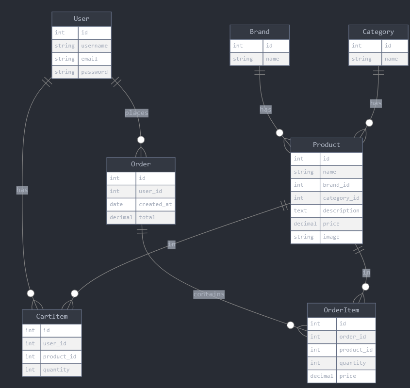

# Sports Nutrition Store

## Description

A simple online store for sports nutrition products. Users can view products, add them to cart, and create orders.

## What the site does

The store owner wants a website where customers can:
- See all products
- Search products by name
- Filter products by category and brand
- View product details
- Register and login
- Add products to cart
- Create orders
- View their order history

---

## API Endpoints

### Products

#### Get all products
- **What it does**: Shows list of all products
- **Method**: `GET`
- **URL**: `/api/products/`
- **Response**:
```json
[
  {
    "id": 1,
    "name": "Whey Protein",
    "brand": "Optimum Nutrition",
    "category": "Protein",
    "price": "45.99",
    "image": "http://example.com/image.jpg"
  }
]
```

#### Get one product
- **What it does**: Shows details of one product
- **Method**: `GET`
- **URL**: `/api/products/1/`
- **Response**:
```json
{
  "id": 1,
  "name": "Whey Protein",
  "brand": "Optimum Nutrition",
  "category": "Protein",
  "description": "High quality protein powder",
  "price": "45.99",
  "image": "http://example.com/image.jpg"
}
```

#### Create product
- **What it does**: Add new product (admin only)
- **Method**: `POST`
- **URL**: `/api/products/`
- **Send**:
```json
{
  "name": "BCAA",
  "brand": "Optimum Nutrition",
  "category": "Amino Acids",
  "description": "Essential amino acids",
  "price": "29.99"
}
```
- **Response**: Created product

#### Update product
- **What it does**: Change product info (admin only)
- **Method**: `PUT`
- **URL**: `/api/products/1/`
- **Send**: Same as create
- **Response**: Updated product

#### Delete product
- **What it does**: Remove product (admin only)
- **Method**: `DELETE`
- **URL**: `/api/products/1/`
- **Response**: Nothing (just success)

---

### Categories

#### Get all categories
- **What it does**: Shows all categories
- **Method**: `GET`
- **URL**: `/api/categories/`
- **Response**:
```json
[
  {
    "id": 1,
    "name": "Protein"
  },
  {
    "id": 2,
    "name": "Vitamins"
  }
]
```

#### Get one category
- **What it does**: Shows category with its products
- **Method**: `GET`
- **URL**: `/api/categories/1/`
- **Response**:
```json
{
  "id": 1,
  "name": "Protein",
  "products": [
    {
      "id": 1,
      "name": "Whey Protein",
      "price": "45.99"
    }
  ]
}
```

---

### Brands

#### Get all brands
- **What it does**: Shows all brands
- **Method**: `GET`
- **URL**: `/api/brands/`
- **Response**:
```json
[
  {
    "id": 1,
    "name": "Optimum Nutrition"
  }
]
```

#### Get one brand
- **What it does**: Shows brand with its products
- **Method**: `GET`
- **URL**: `/api/brands/1/`
- **Response**:
```json
{
  "id": 1,
  "name": "Optimum Nutrition",
  "products": [
    {
      "id": 1,
      "name": "Whey Protein",
      "price": "45.99"
    }
  ]
}
```

---

### Users

#### Register
- **What it does**: Create new user account
- **Method**: `POST`
- **URL**: `/api/register/`
- **Send**:
```json
{
  "username": "john",
  "email": "john@example.com",
  "password": "mypassword123"
}
```
- **Response**:
```json
{
  "id": 1,
  "username": "john",
  "email": "john@example.com"
}
```

#### Login
- **What it does**: Login to account
- **Method**: `POST`
- **URL**: `/api/login/`
- **Send**:
```json
{
  "username": "john",
  "password": "mypassword123"
}
```
- **Response**:
```json
{
  "token": "abc123xyz",
  "user": {
    "id": 1,
    "username": "john"
  }
}
```

#### Get my profile
- **What it does**: Show my user info
- **Method**: `GET`
- **URL**: `/api/profile/`
- **Response**:
```json
{
  "id": 1,
  "username": "john",
  "email": "john@example.com"
}
```

#### Update my profile
- **What it does**: Change my user info
- **Method**: `PUT`
- **URL**: `/api/profile/`
- **Send**:
```json
{
  "email": "newemail@example.com"
}
```
- **Response**: Updated user info

---

### Cart

#### Get my cart
- **What it does**: Show my shopping cart
- **Method**: `GET`
- **URL**: `/api/cart/`
- **Response**:
```json
{
  "items": [
    {
      "id": 1,
      "product": {
        "id": 1,
        "name": "Whey Protein",
        "price": "45.99"
      },
      "quantity": 2
    }
  ],
  "total": "91.98"
}
```

#### Add to cart
- **What it does**: Add product to cart
- **Method**: `POST`
- **URL**: `/api/cart/`
- **Send**:
```json
{
  "product_id": 1,
  "quantity": 2
}
```
- **Response**: Cart item added

#### Update cart item
- **What it does**: Change quantity in cart
- **Method**: `PUT`
- **URL**: `/api/cart/1/`
- **Send**:
```json
{
  "quantity": 3
}
```
- **Response**: Updated cart item

#### Remove from cart
- **What it does**: Delete item from cart
- **Method**: `DELETE`
- **URL**: `/api/cart/1/`
- **Response**: Nothing (just success)

---

### Orders

#### Get my orders
- **What it does**: Show my order history
- **Method**: `GET`
- **URL**: `/api/orders/`
- **Response**:
```json
[
  {
    "id": 1,
    "created_at": "2025-09-20",
    "total": "91.98"
  }
]
```

#### Get one order
- **What it does**: Show order details
- **Method**: `GET`
- **URL**: `/api/orders/1/`
- **Response**:
```json
{
  "id": 1,
  "created_at": "2025-09-20",
  "items": [
    {
      "product": "Whey Protein",
      "quantity": 2,
      "price": "45.99"
    }
  ],
  "total": "91.98"
}
```

#### Create order
- **What it does**: Buy items from cart
- **Method**: `POST`
- **URL**: `/api/orders/`
- **Send**: Nothing (creates order from current cart)
- **Response**: Created order

---

## Database Schema



### Tables:

**User**
- id
- username
- email
- password

**Brand**
- id
- name

**Category**
- id
- name

**Product**
- id
- name
- brand_id (connects to Brand)
- category_id (connects to Category)
- description
- price
- image

**CartItem**
- id
- user_id (connects to User)
- product_id (connects to Product)
- quantity

**Order**
- id
- user_id (connects to User)
- created_at
- total

**OrderItem**
- id
- order_id (connects to Order)
- product_id (connects to Product)
- quantity
- price

---

## Technology

- Django
- Django REST Framework
- SQLite database

---